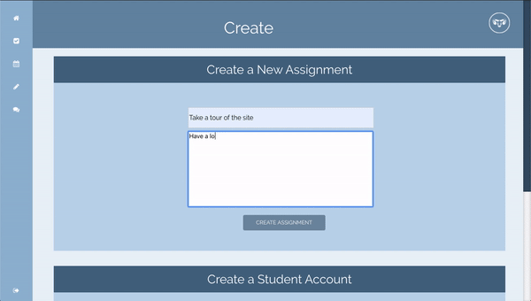

# Bit Academy

A Web Resource for the Education System. With Bit Academy we aim to deliver a robust app that eases the user experience and makes connecting a breeze in the digital age. Utilizing seperate teacher and student portals, users will be able to assign/submit assignments, check in to a session, and chat live via webcam. We hope you enjoy our deomonstration of Bit Academy and see the reliablity of it's use as we would love for you to consider it for your use in your education system.

## Getting Started

Bit Academy is a an online web service and will not have a app to download making it easier to user for the client, Although we plan on making a companion app available on Android and IOS.

### Prerequisites

An Internet Browser running on either Firefox or Google Chrome

## Deployment

Version 1.0 is up and running

## Future Deployment Roadmap

- Video chat available for all users in one room
- Direct messages between teachers/students and students/students
- Upload, Delete custom profile pictures

## Built With

- [Node.Js](https://nodejs.org/en/) - Node.js is designed to build scalable network applications
- [Express](https://expressjs.com/) - Fast, unopinionated, minimalist web framework for Node.js
- [WebRTC](https://webrtc.org/) - Real-time communication capabilities to your application that works on top of an open standard
- [Socket.io](https://socket.io/) - Socket.iO enables real-time, bidirectional and event-based communication.
- [MongoDB](https://www.mongodb.com/) - Distributed database built for modern application developers
- [Firebase](https://firebase.google.com/) - Realtime cloud storage
- [React](https://reactjs.org/) - A JavaScript library for building user interfaces
- [Heroku](https://dashboard.heroku.com/) - Heroku is a platform as a service (PaaS) that enables developers to build, run, and operate applications entirely in the cloud.
- [mLab](https://mlab.com/) - Database-as-a-service

## Demonstration

 

## Authors

- **Christian Maldonado** - _Full Stack_ - [Project 3](https://github.com/christianlMaldonado/Project3)
- **Jennifer Chan** - _Front End_ - [Project 3](https://github.com/christianlMaldonado/Project3)
- **Matthew Bayers** - _Full Stack_ - [Project 3](https://github.com/christianlMaldonado/Project3)
- **Matthew Harris** - _Back End_ - [Project 3](https://github.com/christianlMaldonado/Project3)
- **Niles Bingham** - _Back End_ - [Project 3](https://github.com/christianlMaldonado/Project3)

## License

This project is licensed under the MIT License - see the [LICENSE.md](LICENSE.md) file for details

## Acknowledgments

- Hat tip to anyone whose code was used
- To the TA's that helped us along the way
- to the countless hours and nights stayed up making sure all of the code just works
